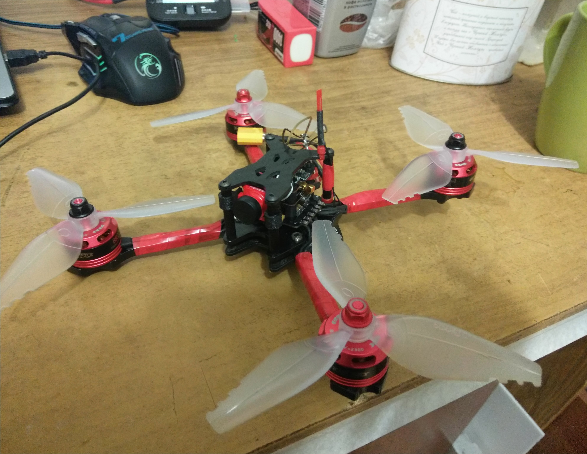

В далеком 2018 была студенткой 1 курса филиала МИФИ, жила в общаге, из хобби был только тренажерный зал(занималась троеборьем с 2016), но к тому моменту интерес вследствие ряда обстоятельств стал затухать, и помимо учебы ничего не оставалось.
К счастью, в том же общежитии жил авиамоделист с многолетним стажем и за кружечкой чая рассказывал о былых временах в авиамодельном кружке.
К весне решилась собрать самолет, рассчитывая на наставничество вдохновителя. Примерно за неделю определилась с моделью (пригляделся биплан), нашлись чертежи, и дальше пошли закупка и поиск необходимых материалов. ПУР-501, потолочная плитка, доски и бруски, в дальнейшем ставшие моторамой и рейками для фюзеляжа, также лобзик и стамеска. 

Также заказала электронику, аппаратуру и аккумуляторы на все накопления. Месяц не спеша доделывала свою первую модель, ожидая электронику и изредка тренируясь в aerofly professional deluxe на чужой аппаратуре.
И, наконец, пробил час, модель была готова, на улице потеплело, пора бить!

P.s. никакого фпв, визуал.

Как и было запланировано, без крашей я домой не возвращалась, была промазана центровка, пропы  оказались не в состоянии бороться с землей, сухие ветки всячески грызли мой бипланчик, и в один из полетов не проверила состояние носа, моторама была повреждена, и при очередном запуске мотор с моторамой описали дугу относительно носа.
Ввиду небольшого разочарования, что модель не летела как я ожидала, решила смастерить крыло. Зная, что это одна из простых и неубиваемых моделей для обучения, не стала тратить время на перерисовку чертежа, придумала свой и ,естественно, не учла, что нужен профиль.. тяп ляп за вечер, и крыло готово. Электроника с биплана перешла на него, и можно было идти бить.

В очередной раз была задняя центровка, купила в рыболовном свинец, довесила на нос, и стало приятнее. С плохим зрением в визуале летело вроде бы неплохо, но сенсей говорил, что ввиду отсутствия профиля так себе вышло.
Он для компании сделал кесл, и его кесл летел и управлялся приятнее моего отчепенца.

Один из полетных вечеров:

Какие итоги можно было подвести: в авиамоделизме спешка вредит. После/перед каждым полетом важно проверять состояние модели, не только отклонения, но и места склейки. Не раз было, что у биплана вырывался кабанчик, и замечала я только во время полета, когда не достигалось нужное отклонение.. Важно соблюдать чертежи, подбирать соответствующие компоненты(первые разы на биплане были с 8" пропеллером, и его не хватало..с 10" полетело), и конечно же отрабатывать все фигуры до запоминания в симуляторе, если всего одна модель на руках.
Летом устроилась на работу, нашлась компания для совместных полетов(хотя до лета мы считали, что помимо нас в городе только деды с внуками на авиамодельном кружке, и мавиководы.. ошибались..потому всем говорю, что не стоит думать наверняка, будто в городе вы единственный пилот. Сообщество растет с каждым годом больше и больше). В компании были и самолетчики и коптеристы, и вертолетчики. И в то время как я приклеивала надежно(на скотч :)) всю электронику, проверяла рули, ребята отлетывали по паку. Решила и себе коптер завести, тем более что пришла первая зарплата. Опять поспешила, но в этот раз с закупкой, взяла регулятор 4 в 1 20\*20, а полетник 30\*30. Взяла чисто потому, что слышала хорошие отзывы о выбранных моделях.. Подобрала раму, выбор основывался по большей части на внешности и цене:D. Cпутала монтажные отверстия (думала что подойдет под 20\*20 и 30\*30), и только при получении регулятора и полетника с разными монтажными отверстиями поняла, что надо было сначала изучить предметную область, а затем закупаться.. заказала регулятор 30\*30, приехала рама.. тут я вообще с себя подгорела. Там были только 20\*20 отверстия. И тут я поняла, что мне предстоит еще и второй коптер :). Докупила полетник 20\*20, благо китайцы слали сразу и почта доставляла в то время по 2-3 недели. Дождалась всех посылок, стала собирать. И тут косяк на косяке-стойки низкие для моей высоты стека, у полетника м2 отверстия, у рамы и рега м3, пластиковых стоек в нужном количестве в комплекте нет, провода короткие у моторов с завода, антенна от видеопередатчика не встает никак, камера упирается в стек..
Что бы я делала без товарищей, которые подогнали стойки, антенну для втх, напечатали крепления под камеру. Но пришлось все равно провозиться, нарастить провода на моторах, улучшить пайку (до этого только паяла хт60 на самолетный регулятор и мотор..терпения не хватало больше всего, хотелось быстрее сделать, но никак не доходило, что не надо возюкать жалом на низкой температуре и экономить флюс)), укоротить стойки пластиковые и закруглить их, чтобы не сносить элементы во время прикручивания, а также расположить все платы, чтобы уместить камеру под нужным углом, и вывести антенну нормально..

Конец сентября..И вот мой долгожданный красавчик готов!

Пока собирала также тренировалась в симуляторе fpvfreerider, на этот раз было проще и быстрее, фпв в акро сразу далось, спустя суммарно часа два в симуляторе отправилась в поле. Обошлось без крашей, почувствовала уверенность, хотя колени тряслись, и уже следующие тренировки проходили рядом с общежитием. Спокойные облеты по кругу, синхронные повороты в ограниченном пространстве, флипы роллы, удержание высоты и плавная посадка-первое, чему стоит учиться. План был выполнен!
А дальше понеслась..собрала коллекторный вуп на зиму, фристайловый 5" на основе первоначально заказанного полетника и докупленного рега, поняла, что сборка приносит огромное удовольствие, и дальше постоянно минимум раз в 2-3 месяца новая сборка..коптеры, крылья, самолеты, в вертики и машинки благо пока не тянет :)
Если интересны мои сборки - переходите в соответствующую вкладку :)
